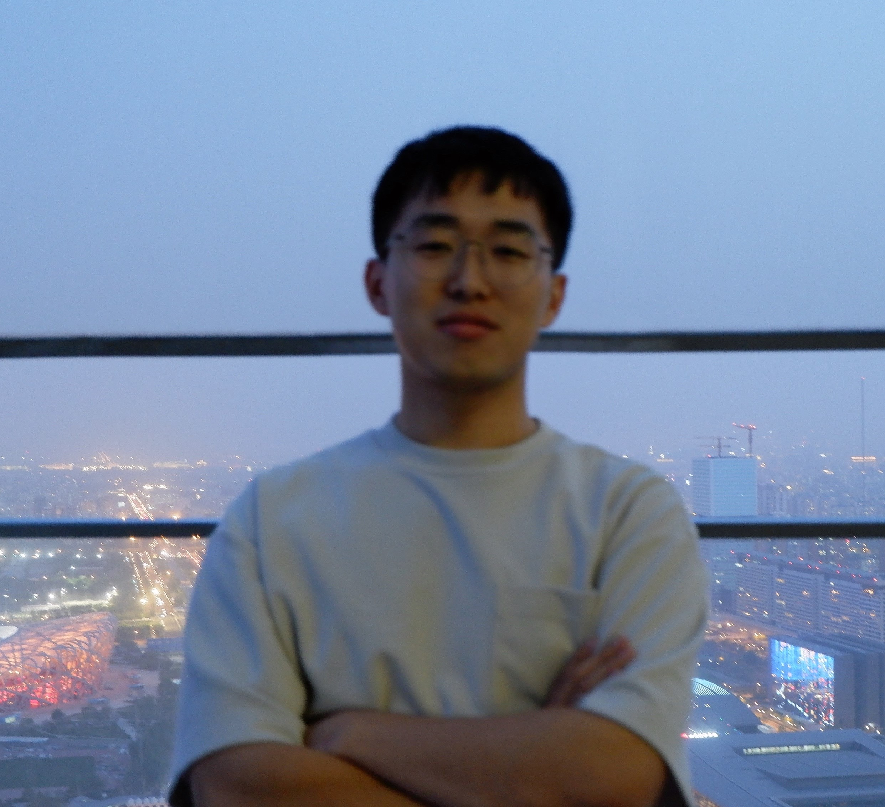

**I'm now an undergraduate in School of EECS and going to be a Ph.D. of School of Electronics in Peking University.**
**My reseach interests mainly focus on Lidar SLAM and Collaborative SLAM.**
**I am also a video creater in Bilibili, which is about interesting mathematical knowledge. Here is my bilibili <a src="https://space.bilibili.com/454293621?spm_id_from=333.1007.0.0">homepage</a>. If you are interested about my account, welcome to follow it.**
